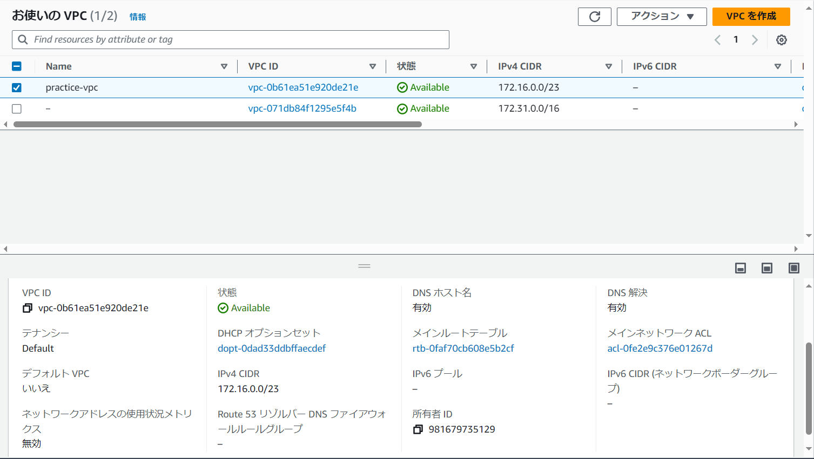
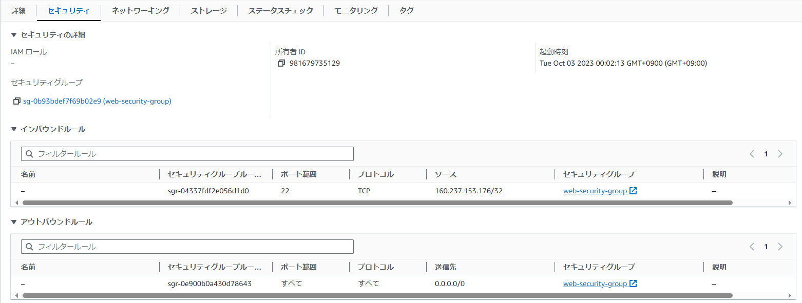
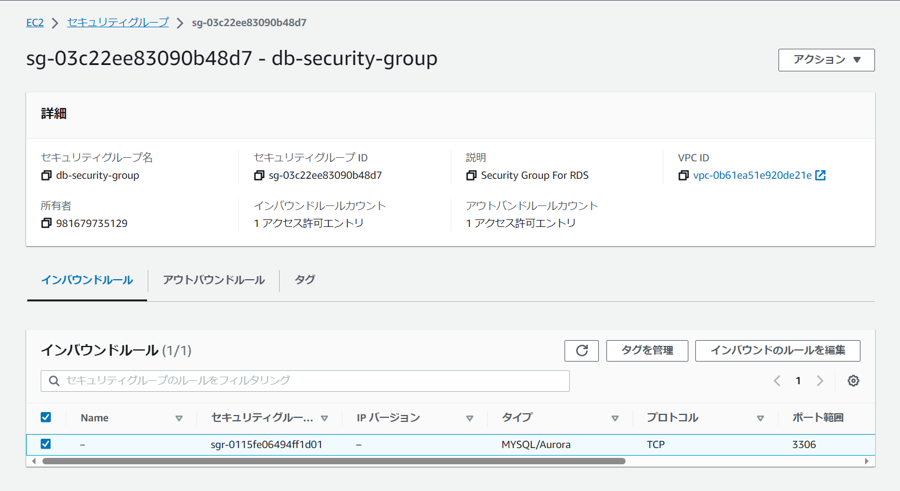
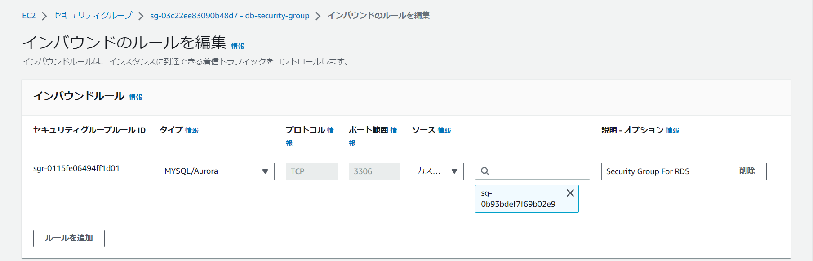
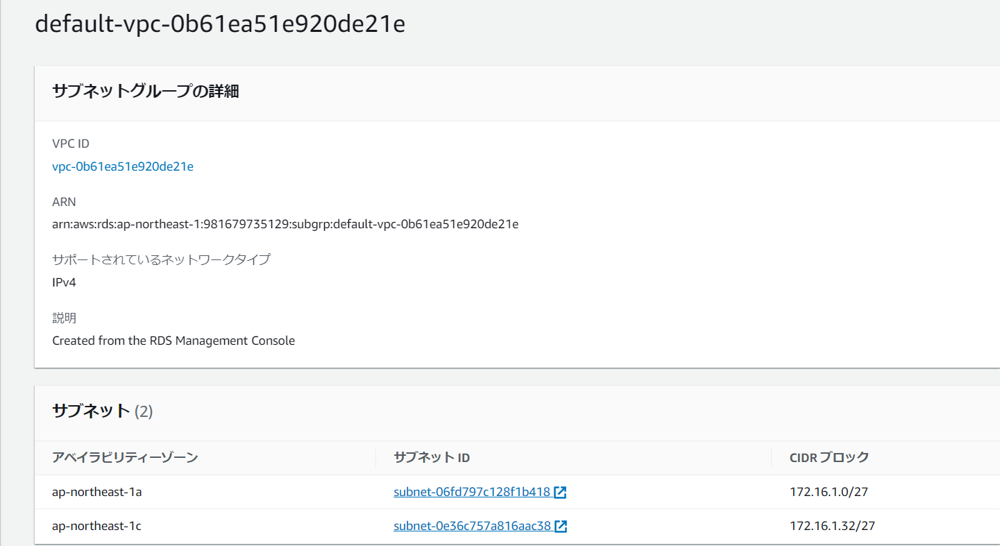
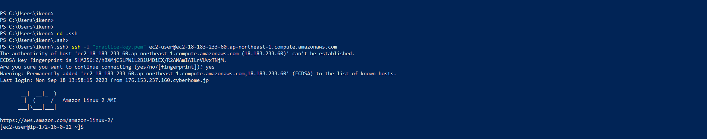
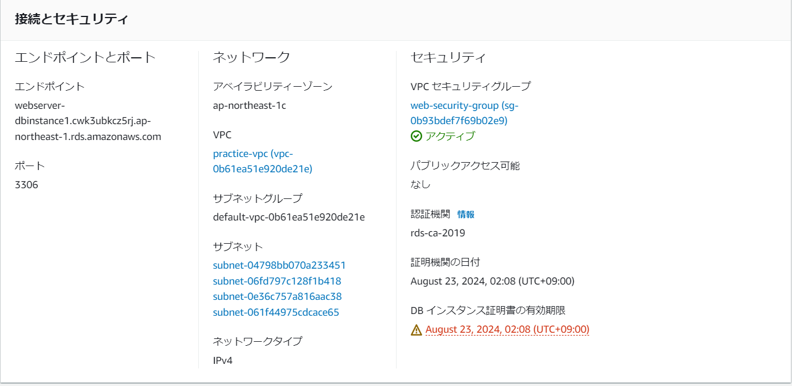
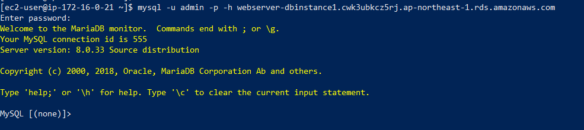

## 第4回課題
- VPCの作成

- セキュリティグループの設定

- サブネットグループの設定

- EC2インスタンスへSSH接続

- RDSの作成

- EC2からRDSへの接続

### 感想
コンソールからSSH接続を行うのに、権限問題やキーペアの配置で時間がかかりました。
また、EC2からRDSへの接続において、PWを打っても何も表示されず、何かが間違っているか足りてないのではないかと
考えました。
下記の3点を確認したらうまくいったので安心しました。
- VPCの接続先が同様か
- エンドポイントが間違っていないか
- セキュリティグループに設定漏れはないか